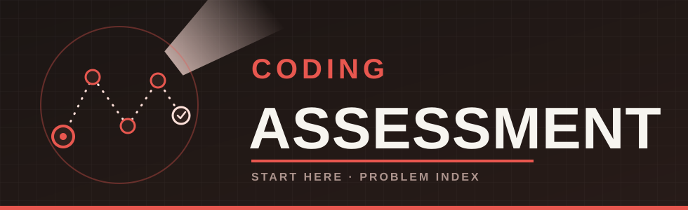

  

# Coding Assessment

Welcome! This repo is the index for our coding assessment — this page
tells you what to expect and how to get set up. Each actual problem
lives in its own repository, linked below.

**You'll be attempting one problem, not all of them.** Take a few
minutes to read it through properly and think about how you'd approach
it before you start typing anything — then have a go. There's no strict
time limit, but out of respect for your time, please don't spend more
than about an hour on it.

These problems are intended to be hard, on purpose. Submitting something
that doesn't fully pass is completely fine, and expected — we're
interested in how you think and how far you get, not just a final green
tick. Push whatever you have when you're done, working or not.

If you get stuck early on and it's just not clicking, feel free to
switch to a different problem from the list below rather than grinding
on the same one. And if you genuinely enjoy this and want to keep going
afterwards, the rest are here for you to try — but there's no
expectation that you will.

**Please don't use AI tools (ChatGPT, Copilot, Claude, or similar) to
write this for you.** As part of the interview process we'll go through
your code together and ask about the choices you made — if you didn't
write it yourself, that conversation is going to be a difficult one.

You'll work in **either Python or Java** (your choice — both are graded
identically), and push your solution to a repository of your own — see
below for exactly how.

---

## The problems

Here's the full set, roughly ordered from warm-up to hardest. Remember —
you only need to attempt one.

| # | Problem | Difficulty | What it's like |
|---|---|---|---|
| 1 | [Pair the Numbers](https://github.com/scottejames/pair-the-numbers-starter) | **Easiest** — warm-up | Find two numbers in a list that add up to a target. Easy to picture — the challenge is doing it without checking every possible pair one by one. |
| 2 | [Split the Playlist](https://github.com/scottejames/split-the-playlist-starter) | **Easy** — warm-up | Split a list into chunks as evenly as you can. Simple to picture, but the "obvious" quick-maths answer turns out to be wrong — a nice lesson in checking your assumptions. |
| 3 | [Escape the Vault](https://github.com/scottejames/escape-the-vault-starter) | **Hard** | Find a path through a grid, picking up keys along the way to unlock doors. Fun to visualise on paper — the tricky part is keeping track of what you've collected so far. |
| 4 | [Break the Cipher](https://github.com/scottejames/break-the-cipher-starter) | **Hard** | Split a run-on string back into real words using a dictionary. Looks simple at first glance, but the straightforward way to try it can quietly run forever on bigger inputs. |
| 5 | [Bridge the Islands](https://github.com/scottejames/bridge-the-islands-starter) | **Hard** | Keep track of which islands end up connected as bridges get added over time. Conceptually simple, but needs a bit of care once there are a lot of islands. |

A couple of things worth knowing going in:

- **You don't need to already know the "textbook" technique for a
  problem.** Every problem is solvable by reasoning carefully from the
  spec and your own test results — the point is to see how you *get*
  there, not whether you memorised the right algorithm name in advance.
- **They get progressively harder.** If you've been pointed at one of
  the later ones, struggling is normal and expected — that's exactly
  why they're calibrated this way, not a sign you've picked wrong.
- Every problem repo is self-contained and has its own `README.md` with
  the actual problem statement, constraints, and a worked example, plus
  an `EXAMPLE.md` with a slower, step-by-step walkthrough. Start there.

---

## Getting set up

Pick whichever suits you — both end up in the same place: your own
private copy of the problem's repo, with your solution pushed to it.

- **Recommended — GitHub Codespaces, nothing to install.** Write and
  run your code entirely in the browser; Python and Java are already
  set up for you. This is a genuine alternative to installing anything
  on your own machine. See **[CODESPACES.md](CODESPACES.md)**.
- **Alternative — work locally.** Install Python or Java yourself and
  use whatever editor you like. See **[LOCAL_SETUP.md](LOCAL_SETUP.md)**.

---

## How to attack a problem

Once you've got your own copy of a problem's repo set up (see above),
here's a sensible way to work through it:

1. **Read the whole `README.md` first**, all the way through, before
   writing any code — the problem statement, the worked example, and
   especially the `### Constraints` section. The size limits there
   usually contain a hint about what kind of approach is expected to
   scale.
2. **Read `EXAMPLE.md`.** It stages the same problem out by hand, one
   decision at a time, and is there specifically to make sure the
   *rules* of the problem are unambiguous before you commit to any
   approach.
3. **Skim `test_data/README.md`.** It documents every single test case
   and *why* it exists. If you get stuck on a failing case later, this
   is the fastest way to understand what it's actually checking.
4. **Only edit the one designated solution file** (named in the repo's
   own `README.md` — everything else is scaffolding that's already
   wired up for you: test data loading, the demo runner, the test
   harness, the shell scripts).
5. **Get something correct before you get it fast.** Aim to pass the
   `simple` tier first, then `medium`, then `hard`. It's completely fine
   to start with a straightforward approach and improve it once it's
   passing — that's a normal, visible part of the process, not something
   to hide.
6. **Run the test script constantly.** It's your entire feedback loop —
   there's no separate grading step or hidden test suite. Re-run it
   after every meaningful change.
7. **Take the `hard` tier seriously.** If it's slow, or a run just hangs
   and never finishes, that's real information about your approach, not
   bad luck — go back and re-read the constraints. Every problem is
   sized so a well-chosen approach finishes quickly and a naive one
   visibly struggles.
8. **You're done with a problem when the test script prints
   `TOTAL: <n> passed, 0 failed`, ending in `Efficiency band: Efficient`.**
   That exact line is what each repo's own README calls "Definition of
   done."

---

Good luck! If you haven't been pointed at a specific problem, [Pair the
Numbers](https://github.com/scottejames/pair-the-numbers-starter) is the
gentlest place to start.
